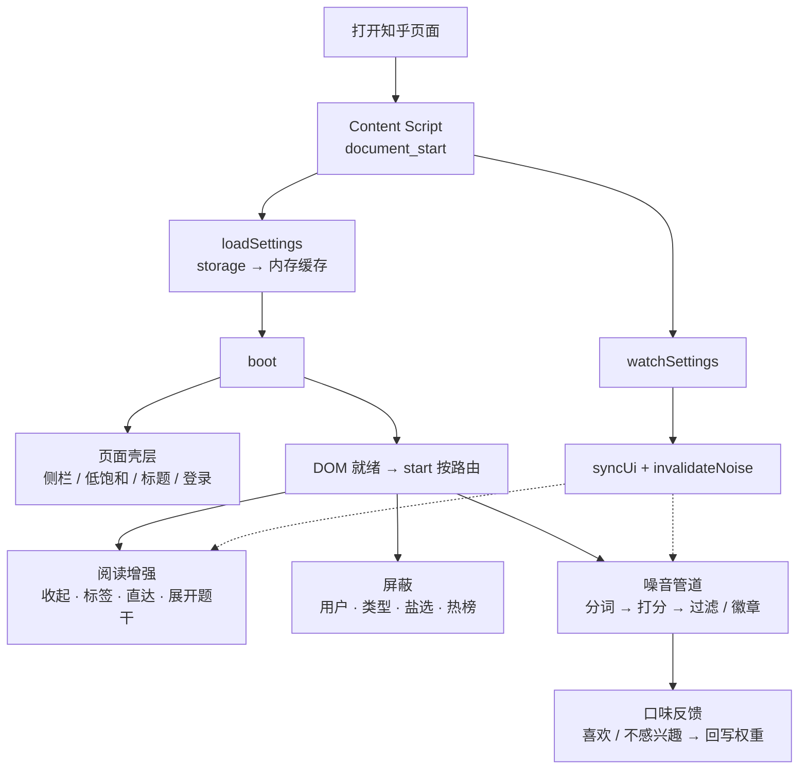

# 知乎增强优化（Zhihu Enhancement Plus）

Chrome 扩展（Manifest V3）：噪音评分过滤（结巴分词整词匹配）、喜欢/不感兴趣回写词权重、低饱和配色、隐藏右侧栏、清空标签标题与图标、移除登录弹窗、屏蔽视频/盐选、默认收起回答、屏蔽用户、原图与站外直链、时间置顶等。

基于 [XIU2/UserScript](https://github.com/XIU2/UserScript) 的「知乎增强」2.2.15，许可证为 GPL-3.0。

互联网内容噪音屏蔽的论文精读清单（DOI / 开放 PDF）：[docs/content-noise-readings.md](docs/content-noise-readings.md)。

隐私政策：[docs/privacy.md](docs/privacy.md)。商店上架素材说明：[store/README.md](store/README.md)。

## 工作流



- **启动**：读 `storage.local` → `boot()` → DOM 就绪后按首页 / 热榜 / 问题等路由挂功能  
- **三条线**：阅读（收起 / 标签 / 直达）、屏蔽（用户 / 类型）、噪音（分词打分 + 口味回写）  
- **改开关**：选项页只写 storage；页面端 `watchSettings` 热更新，虚线表示回灌到阅读 / 噪音

主路径：`src/entrypoints/content.ts` → `src/lib/content/boot.ts`。

## 安装

### 从源码（开发）

1. `npm install && npm run build`
2. Chrome 打开 `chrome://extensions`
3. 打开「开发者模式」
4. 「加载已解压的扩展程序」，选仓库里的 `.output/chrome-mv3`

设置页：工具栏图标 →「打开完整设置」，或扩展详情里的「扩展程序选项」。

### 从 GitHub Release（推荐给使用者）

打版本 tag 后，Actions 会自动 `npm run zip` 并把包挂到 [Releases](../../releases)：

```bash
# 1. 版本号与 src/lib/version.ts、package.json 对齐
# 2. 提交并推送 main
git tag v2.3.0
git push origin v2.3.0
```

在 Releases 下载 `zhihu-enhancement-plus-*-chrome.zip`，解压后用「加载已解压的扩展程序」选解压目录（或把 zip 交给 Chrome 商店上传）。

### 自动发布到 Chrome 网上应用店

同一套 tag 流程可顺带上传商店并送审。需先手动在商店创建商品，再配置 Secrets / 变量，详见 [docs/chrome-web-store-publish.md](docs/chrome-web-store-publish.md)。

## 开发

现代栈：**WXT + TypeScript + React 19 + Tailwind CSS v4 + shadcn/ui**。

- 内容脚本：`src/entrypoints/content.ts`，页面逻辑在 `src/lib/content/`
- 打分 / 词库 / 结巴：`src/lib/noise/`
- 设置页：`src/entrypoints/options/`（React + shadcn）
- 弹层：`src/entrypoints/popup/`
- 存储：`chrome.storage.local`
- 结巴 WASM：`public/jieba_rs_wasm_bg.wasm`
- 发版：`.github/workflows/release.yml`（`v*` tag → GitHub Release；可选 Chrome Web Store）

```bash
npm install
npm run dev      # 开发模式，自动装进浏览器
npm run build    # 产出 .output/chrome-mv3
npm run zip      # 产出 .output/*-chrome.zip
npm run typecheck
```

版本号只改 `src/lib/version.ts`（并同步 `package.json`）。
