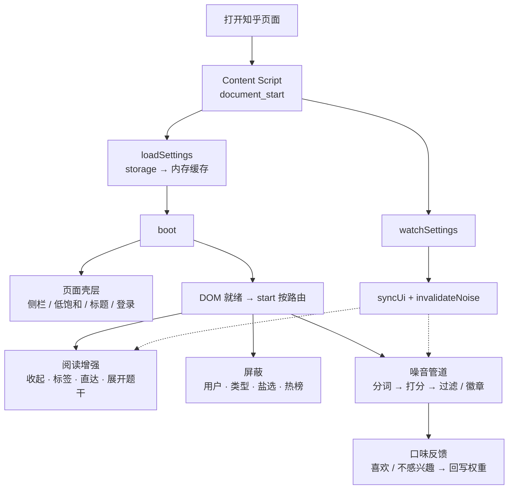
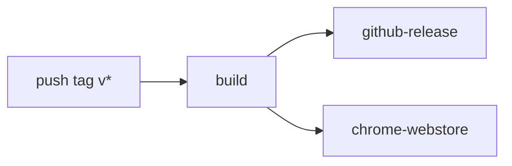

# 知乎增强优化（Zhihu Enhancement Plus）

Chrome 扩展（Manifest V3）：噪音评分过滤（结巴分词整词匹配）、喜欢/不感兴趣回写词权重、低饱和配色、隐藏右侧栏、清空标签标题与图标、移除登录弹窗、屏蔽视频/盐选、默认收起回答、屏蔽用户、原图与站外直链、时间置顶等。

基于 [XIU2/UserScript](https://github.com/XIU2/UserScript) 的「知乎增强」2.2.15，许可证为 GPL-3.0。

互联网内容噪音屏蔽的论文精读清单（DOI / 开放 PDF）：[docs/content-noise-readings.md](docs/content-noise-readings.md)。

隐私政策：[docs/privacy.md](docs/privacy.md)。商店上架素材说明：[store/README.md](store/README.md)。发版流水线：[GitHub CI](#github-ci)。

Chrome 网上应用店：[知乎增强优化](https://chromewebstore.google.com/detail/hbdicbmlaoccmagflnadkemleobkfgko)。

## 工作流



- **启动**：读 `storage.local` → `boot()` → DOM 就绪后按首页 / 热榜 / 问题等路由挂功能  
- **三条线**：阅读（收起 / 标签 / 直达）、屏蔽（用户 / 类型）、噪音（分词打分 + 口味回写）  
- **改开关**：选项页只写 storage；页面端 `watchSettings` 热更新，虚线表示回灌到阅读 / 噪音

主路径：`src/entrypoints/content.ts` → `src/lib/content/boot.ts`。

## 安装

### 从源码（开发）

1. `npm install && npm run build`
2. Chrome 打开 `chrome://extensions`
3. 打开「开发者模式」
4. 「加载已解压的扩展程序」，选仓库里的 `.output/chrome-mv3`

设置页：工具栏图标 →「打开完整设置」，或扩展详情里的「扩展程序选项」。

### 从 GitHub Release（推荐给使用者）

打 `v*` tag 后，[Release workflow](#github-ci) 会把 zip 挂到 [Releases](../../releases)。下载 `zhihu-enhancement-plus-*-chrome.zip`，解压后用「加载已解压的扩展程序」选解压目录。

```bash
# 版本号与 src/lib/version.ts、package.json 对齐，且高于商店当前版本
git tag v2.3.7
git push origin v2.3.7
```

## 开发

现代栈：**WXT + TypeScript + React 19 + Tailwind CSS v4 + shadcn/ui**。

- 内容脚本：`src/entrypoints/content.ts`，页面逻辑在 `src/lib/content/`
- 打分 / 词库 / 结巴：`src/lib/noise/`
- 设置页：`src/entrypoints/options/`（React + shadcn）
- 弹层：`src/entrypoints/popup/`
- 存储：`chrome.storage.local`
- 结巴 WASM：`public/jieba_rs_wasm_bg.wasm`

```bash
npm install
npm run dev      # 开发模式，自动装进浏览器
npm run build    # 产出 .output/chrome-mv3
npm run zip      # 产出 .output/*-chrome.zip
npm run typecheck
```

版本号只改 `src/lib/version.ts`（并同步 `package.json`）。

## GitHub CI

`.github/` 目前只有两份文件，没有 issue/PR 模板或其它 workflow。

| 路径 | 作用 |
|------|------|
| [`.github/workflows/release.yml`](.github/workflows/release.yml) | 唯一 workflow：打 `v*` tag 后打包、发 GitHub Release、上传 Chrome 网上应用店 |
| [`.github/dependabot.yml`](.github/dependabot.yml) | 每周扫一次根目录 npm 依赖，最多同时开 10 个升级 PR |

跑一次记录：[Actions](https://github.com/wenf0/zhihu-enhancement-plus/actions)。商店凭证与手动上传见 [docs/chrome-web-store-publish.md](docs/chrome-web-store-publish.md)。

### Release

触发：推送匹配 `v*` 的 tag（例如 `v2.3.7`）。运行环境 Node 22。



| Job | 做什么 |
|-----|--------|
| `build` | `npm ci` → `npm run typecheck` → `npm run zip` → 上传 `.output/zhihu-enhancement-plus-*-chrome.zip` 为 artifact |
| `github-release` | 等 `build` 完成后，把 zip 挂到该 tag 的 GitHub Release，并自动生成 notes |
| `chrome-webstore` | 仅当仓库变量 `CHROME_WEBSTORE_UPLOAD=true`：用 Secrets 把同一份 zip 上传商店并送审 |

`chrome-webstore` 需要的 Secrets：`CHROME_EXTENSION_ID`、`CHROME_CLIENT_ID`、`CHROME_CLIENT_SECRET`、`CHROME_REFRESH_TOKEN`、`CHROME_PUBLISHER_ID`。审核仍由 Google 处理；同一版本号不能重复上传。

`package.json` 里显式写了 optional `@rolldown/binding-linux-x64-gnu`：lockfile 在 macOS 生成时不会记下 Linux 原生绑定，没有它 `npm ci` 在 ubuntu runner 上会缺 rolldown。
